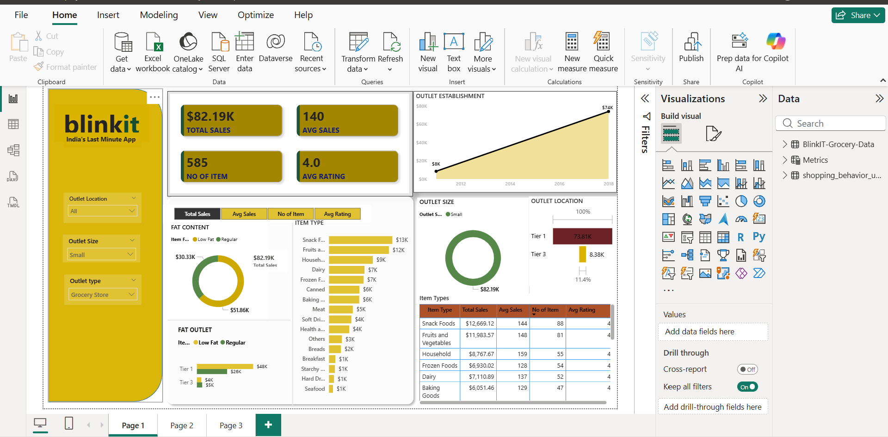
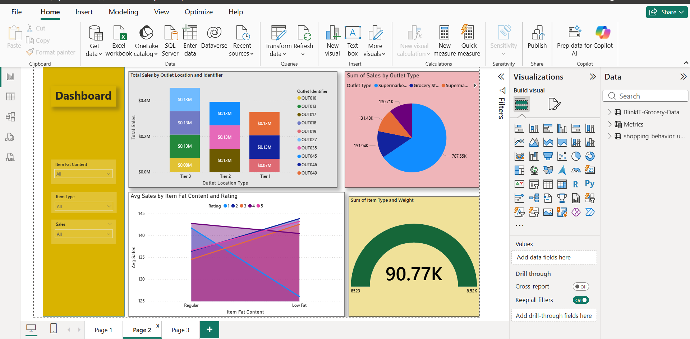
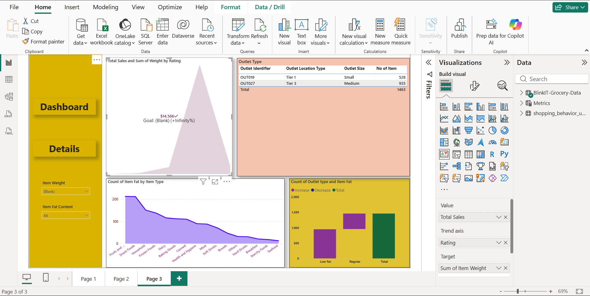

# 🛒 Blinkit Sales Analytics Dashboard (Power BI)

## 📌 Project Overview
An end-to-end interactive Power BI dashboard analyzing sales performance, outlet establishments, item fat content, and customer satisfaction metrics for Blinkit grocery data.

---

## 📊 Dashboard Views

### 1. Overall Sales & Metrics Overview

### 2. Detailed Sales Analysis

### 3. Outlet & Establishment Details

---

## 🔑 Key Business Insights & KPIs Tracked
- **Total Revenue & Average Sales:** Monitored total revenue and average sales per item category.
- **Outlet Establishment Trends:** Tracked outlet growth trends across various establishment years.
- **Item Fat Content Breakdown:** Analyzed revenue split between Low Fat and Regular products.
- **Location Tier Analysis:** Evaluated sales performance across Tier 1, Tier 2, and Tier 3 cities.
- **Outlet Size Performance:** Assessed high-performing outlets based on store size and location.

---

## 🛠️ Tools & Technologies Used
- **Power BI Desktop:** Dynamic visualizations, drill-through filters, and dashboards
- **Power Query:** Data extraction, transformation, cleaning, and ETL pipelines
- **DAX (Data Analysis Expressions):** Calculated measures, KPIs, and aggregated metrics
- **Dataset:** Blinkit Grocery Data (CSV)

---

## 📂 Repository Contents
- `proj.1 blinkit.final (1).pbix` : Power BI Workbook File
- `BlinkIT-Grocery-Data.csv` : Raw Dataset
- Screenshots: `dashboard_overview.png`, `dashboard_sales_analysis.png`, `dashboard_outlet_details.png`

